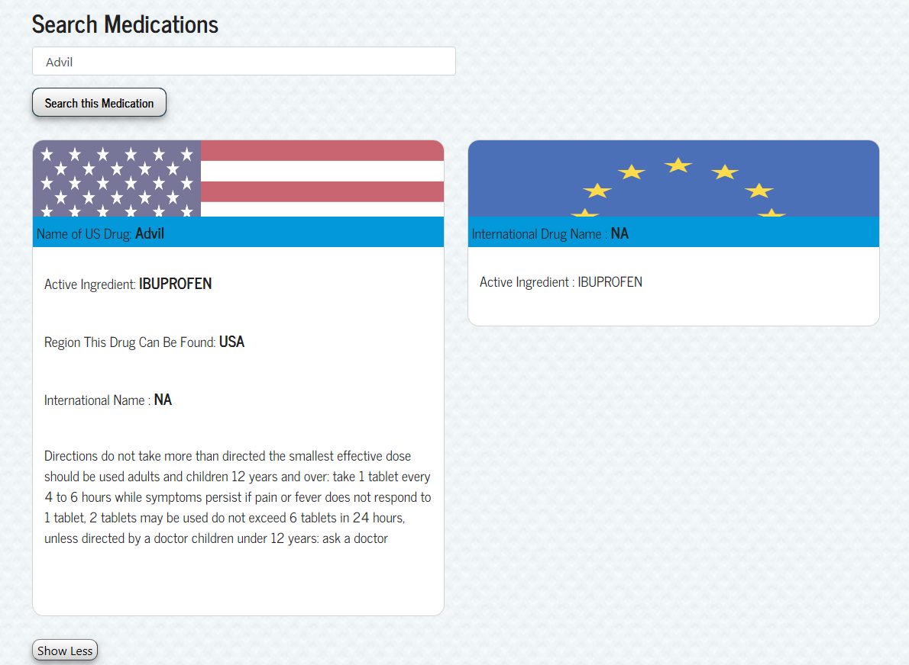
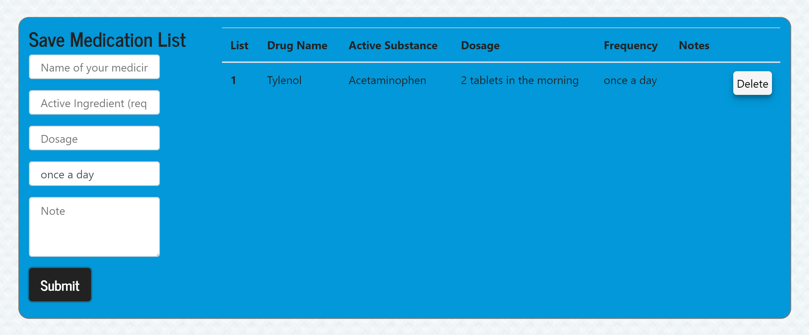
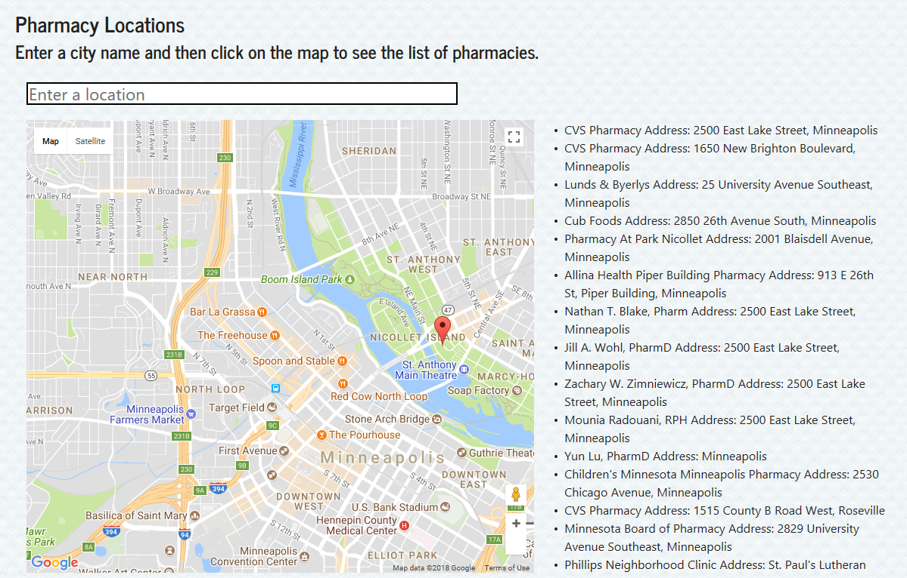

# GlobalPrescription

This app gives the user access to Federal Drug Administration database that houses a list of drugs. Then the app finds the drug international equivalencies based on a active ingredient. This database could also serve as a patient database for hospitals in the third world countries who still keep track of patient information using pen and paper.

**Accessing the App**

You can find the app on
[Heroku](https://evening-sea-66958.herokuapp.com/)

**User Flow**

1. Login to your app

2. Search for medication using Federal Drug Administration Database

3. Save the prescription you are taking

4. Find the nearest pharmacy 

**Technology used**

APIs: Federal Drug Administration, Google Maps

Axios, Body-Parser, Bootstrap, React, Reactstrap, Google-Map-React npm

express: builds server-side routes and functions

mongoose: is in charge of database

morgan: logs server-side requests and helps with debugging

