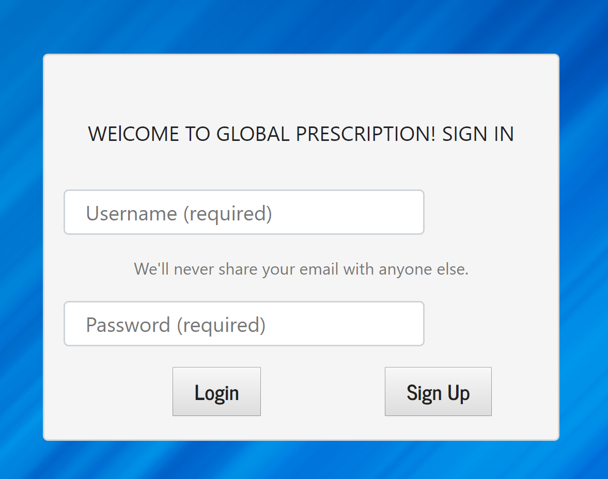

# GlobalPrescription

### Team Global Prescription

### Members: Edyta Dudek, Sam Mwangi, Nathan Bos, Walter Zuschlag, Amin Kedir

### Try us at url: https://evening-sea-66958.herokuapp.com/
### Bypass the login with url: https://evening-sea-66958.herokuapp.com/drugs

Proposal
Have you ever traveled abroad and fell ill, only to find that the medication you were so used to in your home country is either not available or….well, you don’t know what it’s called. Well for the purpose of this final project we decided to create a database that houses a list of drugs along with its international equivalencies. This database will also serve as a patient database for hospitals in third world countries who still keep track of patient information using pen and paper.

We split duties between the five of us with three focusing on back end and two on front end. One individual who is doing back end will also jump between front and back end to assist. 

Back end developers: Edyta, Amin, Nate. 

Front end developers: Sam, Walter, Amin

Todays purpose will be to design front-end UI and also list components to use for database structure (mongoose or mySQL etc..) 

- Discussed Front-End and straw horse design.
- Found Drugsbankplus API to pull prescription drugs data
- Discussed database (Mongo DB / MySql)
- Discussed team member roles and all in agreement based on preference and willing to assist as needed.
- Added Trello
- Added GitHub Repo.
- Discussed Meeting schedule.
- Discussed on maintaining a good communication 

We will be using Trello to for project management, and constantly push and pull to the github master branch. 

### Technology used
- reactstrap
- mongoDB

# GlobalPrescription

This app gives the user access to Federal Drug Administration database that houses a list of drugs. Then the app finds the drug international equivalencies based on a active ingredient. This database could also serve as a patient database for hospitals in the third world countries who still keep track of patient information using pen and paper.

**Accessing the App**

You can find the app on
[Heroku](https://evening-sea-66958.herokuapp.com/)

**User Flow**

1. Login to your app

2. Search for medication using Federal Drug Administration Database

3. Save the prescription you are taking

4. Find the nearest pharmacy 

**Technology used**

APIs: Federal Drug Administration, Google Maps

Axios, Body-Parser, Bootstrap, React, Reactstrap, Google-Map-React npm

express: builds server-side routes and functions

mongoose: is in charge of database

morgan: logs server-side requests and helps with debugging
