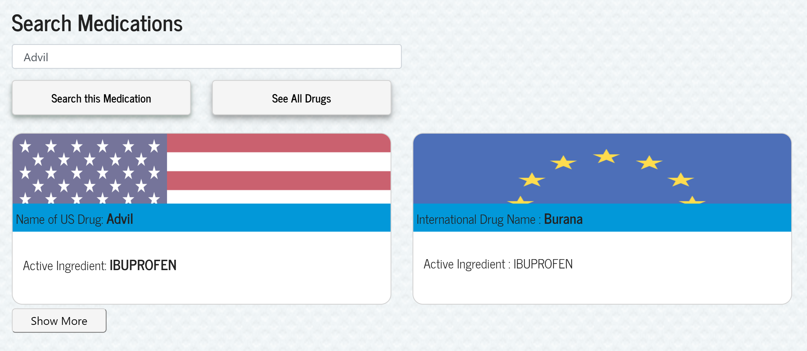

# GlobalPrescription

This app gives the user access to the Federal Drug Administration database that houses a list of drugs. Then the app finds the drug's international equivalencies based on an active ingredient. This database could also serve as a patient database for hospitals in the third world countries who still keep track of patient's information using pen and paper.

**Accessing the App**

You can find the app on
[Heroku](https://evening-sea-66958.herokuapp.com/)

[Bypass login](https://evening-sea-66958.herokuapp.com/drugs)

**How to run the App**

1. Instal dependencies by running “yarn install” at the project root and `yarn install` again from within the `client` folder. 
2. Start the application by running “yarn start” from the project root.   
3. Remember to have mongod and mongo open in the terminal. 
4. To populate the application with the information stored in the database use “yarn seed” command from the project root.   

**User Flow**

1. Login to your app

2. Search for medication using Federal Drug Administration database

3. Save the prescription you are taking

4. Find the nearest pharmacy 

**Technology used**

APIs: Federal Drug Administration, Google Maps

Axios, Body-Parser, Bootstrap, React, Reactstrap, Google-Map-React npm

express: builds server-side routes and functions

mongoose: is in charge of database

morgan: logs server-side requests and helps with debugging
